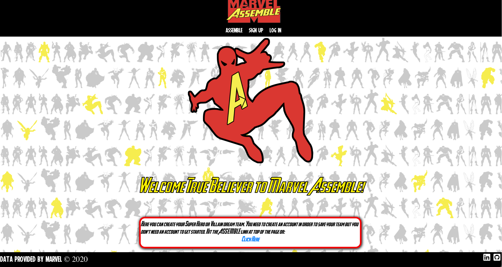
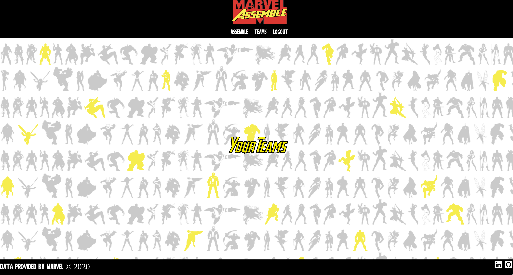
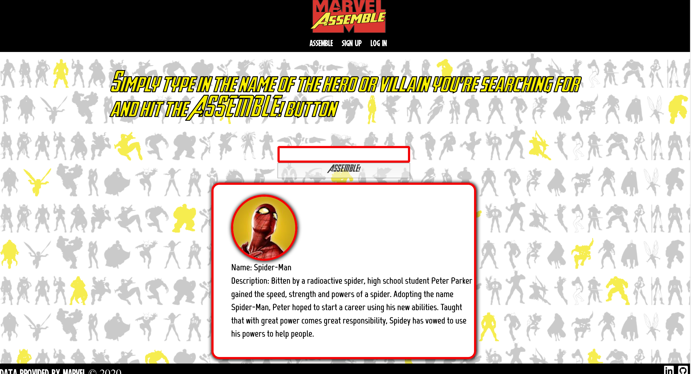
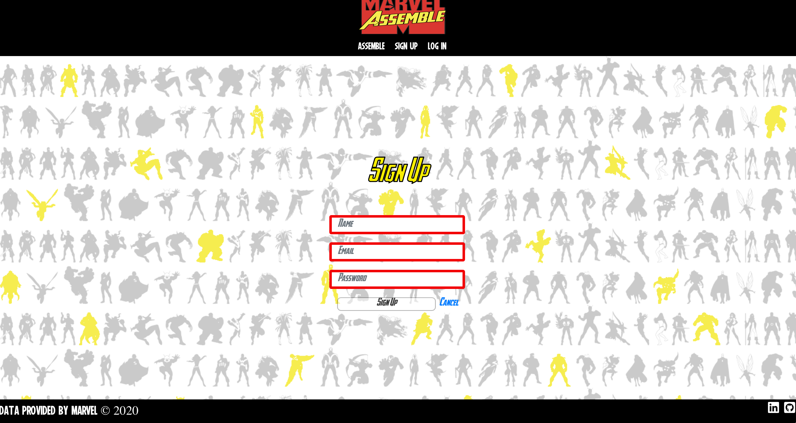
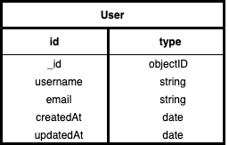
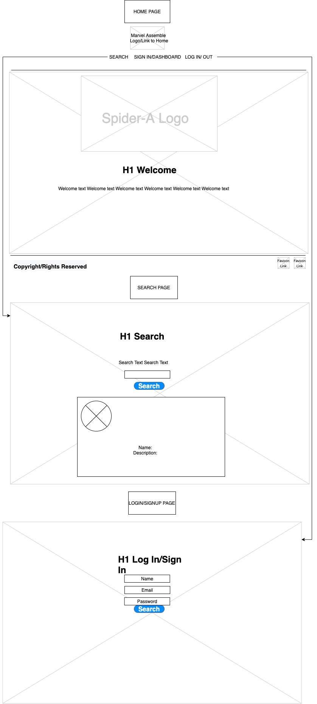

# Marvel Assemble

Marvel Assemble is a full-stack MERN app that allows a user to search for a Marvel hero through Marvel's API.

I was inspired to make this app becuse I'm a huge comic nerd who has spent hours of his life basically doing this in his head without an app.

## Getting Started
 [Click Here](https://marvel-assemble.herokuapp.com/) to see the deployed app. You can sign up, log in and log out. You can also utilize the search functionality to call up the hero of your choice.

## Screenshots
Home: 
Dashboard: 
Search: 
Sign-Up: 

##  Technologies/API used:

- Node
- Express
- MongoDB/Mongoose
- HTML5
- CSS3
- AJAX
- JavaScript
- jQuery
- JSX
- React
- Heroku
- Procreate -logo
- Gimp - logo/background
- draw.io - for wireframe/ERD
- MARVEL's API

## Trello:

[Click Here](https://trello.com/b/iuzoDFTW/project-3) to view my Trello board.

## ERD:

## Wireframe: 

## User Stories:

- AAU - I should be able to navigate to the home page
- AAU - I should be able to sign up for a new account
- AAU - I should be able to log in/log out from my account
- AAU - I should be able to search for a super hero/villain

## Stretch Goals/Future Goals:

- AAU - I should be able to add the hero/villain to a team
- AAU - I should be able to save the team and perform CRUD operations on the team
- Progmatically designed Background
- Fade in Styling Effects on the nav bar
- Super hero search/team manager with animation
- Sound cues for CRUD functionality 

